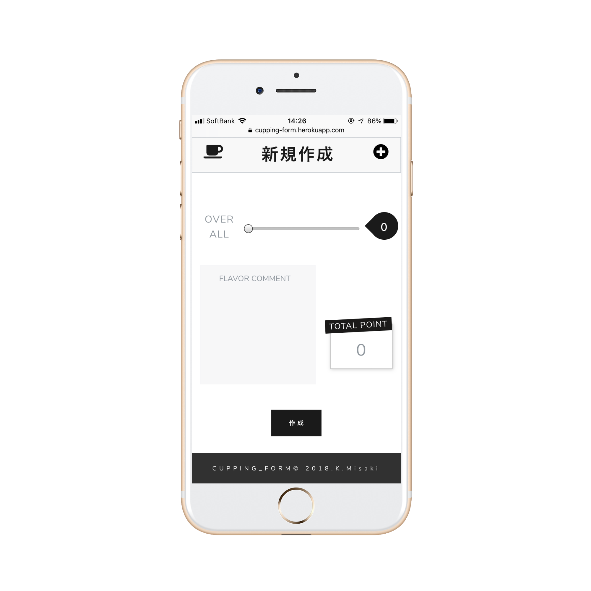

## 自己紹介

はじめまして。
コーヒーが好きでバリスタとして働いています。

### スキル
* HTML
* CSS
* Ruby on Rails
* Java Script

### 作ったもの

コーヒーの採点をする際に使う
”カッピングシート”というものを、
より簡潔にわかりやすく作成、保存できるサービスを作りました。

### 連絡先
E-mail: pinguuuuuuv3o@gmail.com